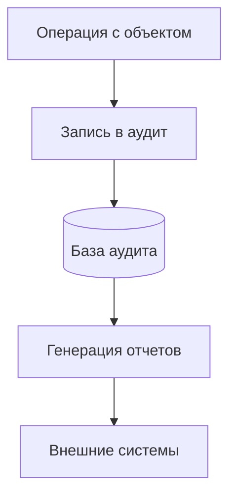

# Настройка аудита

## Схема работы аудита


## Включение аудита
```csharp
services.AddFlexberryORM(config => 
{
    config.EnableAudit(auditConfig =>
    {
        auditConfig.AuditEnabled = true;
        auditConfig.AppName = "MyApp";
        auditConfig.AuditConnectionStringName = "AuditDB";
    });
});
```

## Конфигурация БД аудита
```xml
<connectionStrings>
  <add name="AuditDB" 
       providerName="MSSQLDataService"
       connectionString="Server=.;Database=AuditDB;Integrated Security=True"/>
</connectionStrings>
```

## Поля аудита
```csharp
[Audit(
    IncludeDetails = true,
    StorageType = AuditStorageType.Full,
    ViewName = "AuditView")]
public class Order : DataObject
{
    // ...
}
```

## Типы аудируемых событий
1. Создание объектов
2. Изменение данных
3. Удаление объектов
4. Чтение конфиденциальных данных

[Пример отчетов →](../examples/audit-reports.md)
