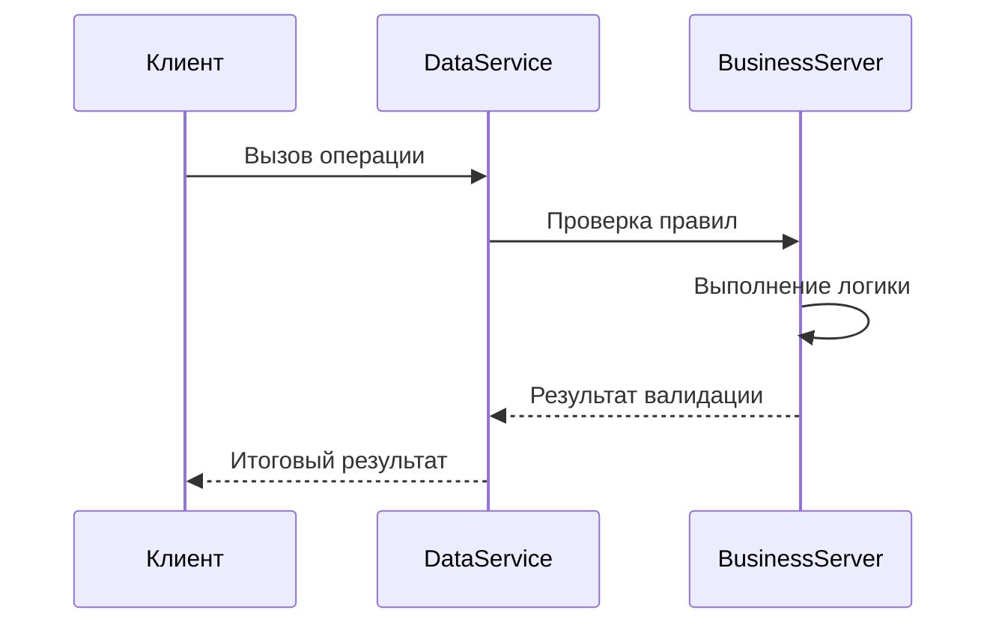

# Бизнес-серверы: Основные концепции

## Архитектура выполнения


## Типы бизнес-серверов
1. **Серверы валидации**
2. **Серверы вычислений**
3. **Серверы интеграции**
4. **Серверы аудита**

## Пример реализации
```csharp
public class OrderBS : BusinessServer
{
    public override DataObject[] OnUpdateOrder(Order updatedOrder)
    {
        if (updatedOrder.Total < 0)
            throw new Exception("Сумма заказа не может быть отрицательной");
        
        if (updatedOrder.Status == "Closed")
            updatedOrder.CloseDate = DateTime.Now;
            
        return new DataObject[] { updatedOrder };
    }
}
```

## Конфигурация подключения
```xml
<businessServers>
  <server type="MyApp.BusinessServers.OrderBS, MyApp"
          operation="Update"
          class="MyApp.Order"/>
</businessServers>
```

[Пример сложной логики →](../examples/advanced-business-server.md)
