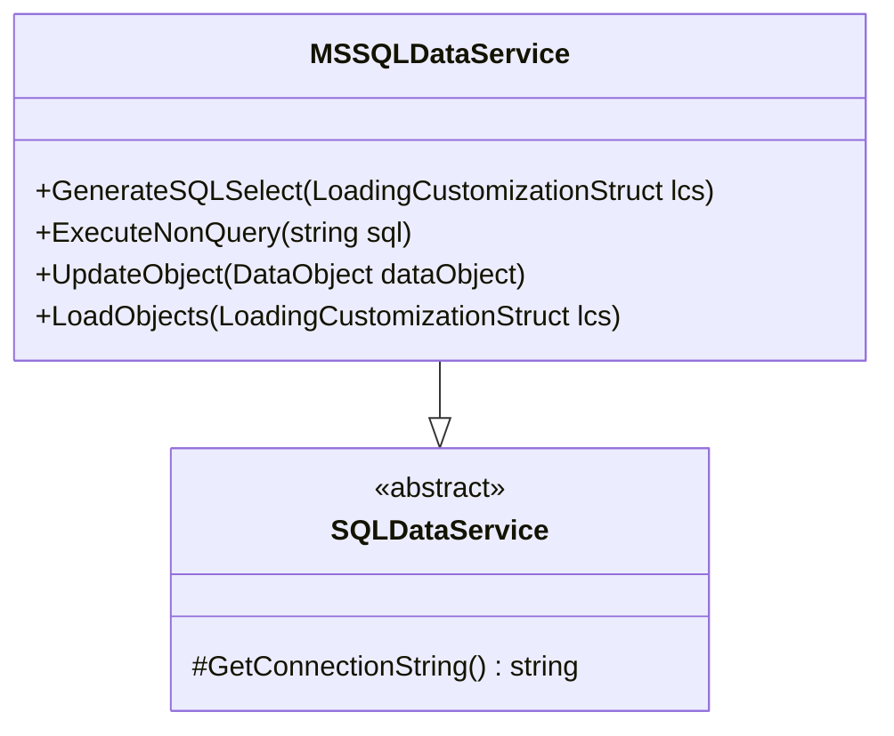

# DataService для Microsoft SQL Server

## Особенности реализации


## Пример запроса
```csharp
var lcs = LoadingCustomizationStruct.GetSimpleStruct(typeof(Клиент), View.GetDefaultView(typeof(Клиент)));
lcs.LimitFunction = SQLWhereLanguageDef.LanguageDef.GetFunction(
    SQLWhereLanguageDef.LanguageDef.funcEQ,
    new VariableDef(Information.ExtractPropertyType(typeof(Клиент), "Имя"), "Имя"),
    "Иван Петров");

var clients = DataServiceProvider.DataService.LoadObjects(lcs);
```

## Настройка соединения
```xml
<configuration>
  <connectionStrings>
    <add name="MSSQLConn" 
         providerName="MSSQLDataService"
         connectionString="Server=localhost;Database=FlexberryDemo;Integrated Security=True"/>
  </connectionStrings>
</configuration>
```

## Оптимизация производительности
1. Использование пакетных операций
2. Настройка индексов в БД
3. Кэширование часто используемых объектов

[Пример миграции →](../examples/mssql-migration.md)
