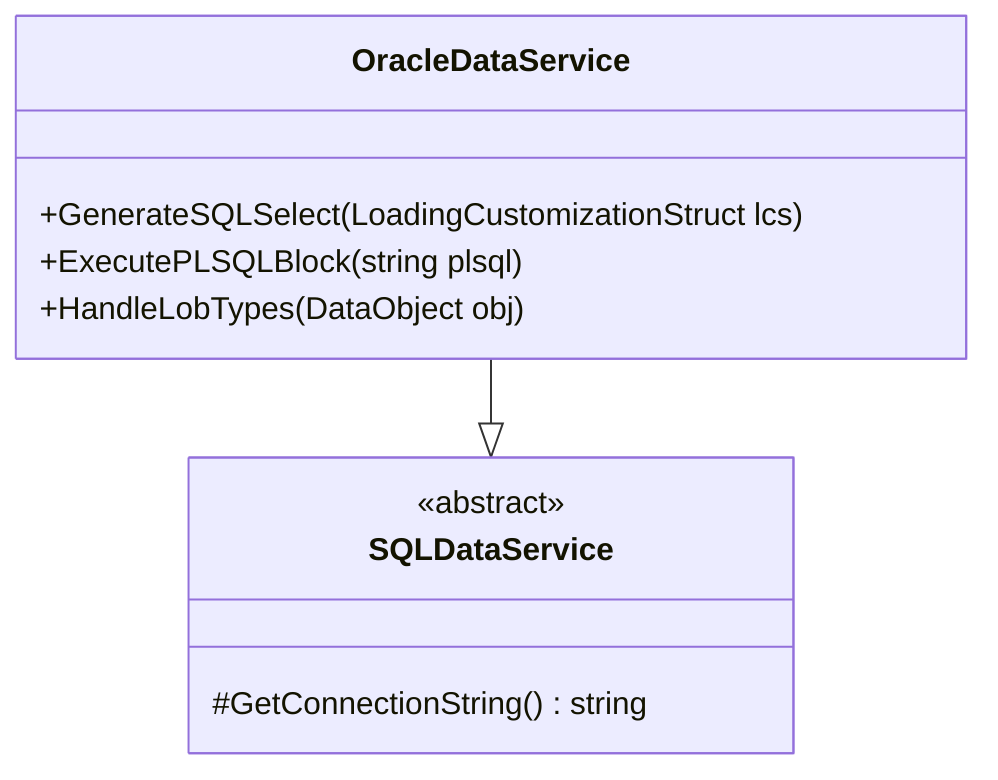

# DataService для Oracle Database

## Особенности реализации


## Пример работы с PL/SQL
```csharp
var lcs = LoadingCustomizationStruct.GetSimpleStruct(typeof(Счет), View.GetDefaultView(typeof(Счет)));
lcs.LimitFunction = FunctionBuilder.BuildEquals<Счет>(x => x.Статус, "Оплачен");

using (var dao = DataServiceProvider.DataService)
{
    var query = dao.GetLcsQuery(lcs, QueryType.PLSQL);
    var result = dao.ExecutePlainSQL(query);
}
```

## Настройка параметров
```xml
<add name="OracleConn" 
     providerName="OracleDataService"
     connectionString="User Id=system;Password=pass;Data Source=XE"/>
```

## Оптимизация для Oracle
1. Использование пакетных операций FORALL
2. Настройка табличных пространств
3. Работа с секционированными таблицами

[Пример миграции →](../examples/oracle-migration.md)
