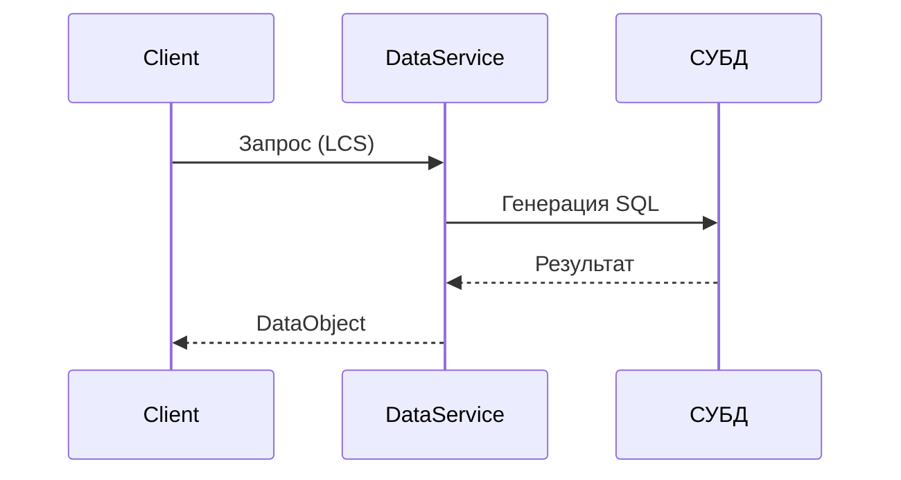

# Data Service: Обзор

## Архитектура взаимодействия


## Поддерживаемые СУБД
1. [MSSQL](mssql.md)
2. [Oracle](oracle.md)
3. [PostgreSQL](postgres.md)

## Основные методы
```csharp
public virtual void UpdateObject(DataObject dataObject);
public virtual DataObject[] LoadObjects(LoadingCustomizationStruct customizationStruct);
public virtual void DeleteObject(DataObject dataObject);
```

## Конфигурация
```xml
<add name="MSSQLConnStr" 
     connectionString="Server=.;Database=Flexberry;Integrated Security=True"
     providerName="MSSQLDataService" />
```

[Далее: Настройка подключений](configuration.md)
