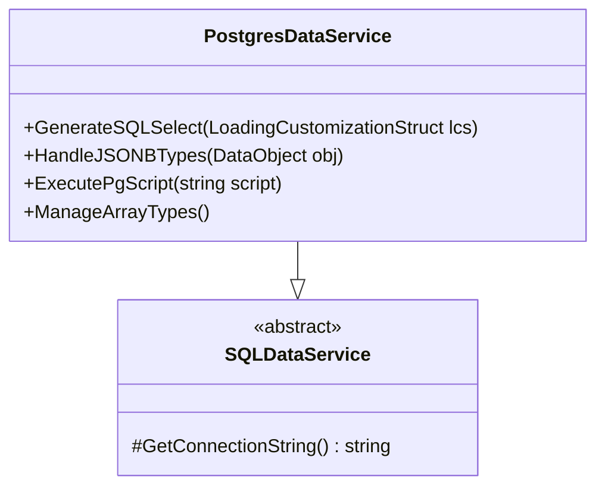

# DataService для PostgreSQL

## Особенности реализации


## Пример работы с JSONB
```csharp
var view = new View { DefineClassType = typeof(Профиль) };
view.AddProperty("Данные", "JSONData");

var lcs = LoadingCustomizationStruct.GetSimpleStruct(typeof(Профиль), view);
lcs.LimitFunction = FunctionBuilder.BuildJsonContains<Профиль>(x => x.JSONData, 
    "{\"preferences\": {\"theme\": \"dark\"}}");

var profiles = DataServiceProvider.DataService.LoadObjects(lcs);
```

## Настройка соединения
```xml
<add name="PostgresConn" 
     providerName="PostgresDataService"
     connectionString="Server=localhost;Database=flexberry;User Id=postgres;Password=admin;"/>
```

## Специфические возможности
1. Поддержка JSONB-полей
2. Работа с массивами данных
3. Использование расширений PostGIS
4. Оптимизация через частичные индексы

[Пример миграции →](../examples/postgres-migration.md)
