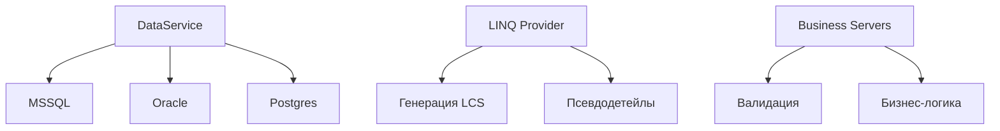

# Flexberry ORM Документация

## Основные компоненты

## Содержание
1. [Установка и настройка](installation.md)
2. [Быстрый старт](quickstart.md)
3. [Data Service](dataservice/overview.md)
4. [LINQ-провайдер](linq-provider/basics.md)
5. [Бизнес-серверы](business-servers/concepts.md)
6. [Система блокировок](locking/theory.md)
7. [Аудит и безопасность](audit/setup.md)
8. [Docker-развертывание](docker/deployment.md)
9. [Примеры использования](examples/crud-operations.md)
