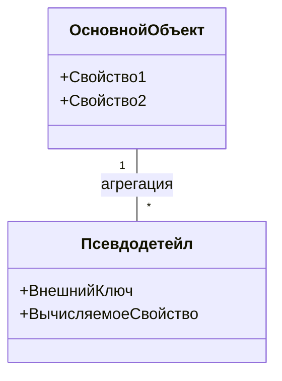

# Работа с псевдодетейлами

## Концепция псевдодетейлов


## Пример использования
```csharp
var query = ds.Query<Заказ>()
    .Where(z => z.Псевдодетейл.Any(p => p.Сумма > 1000))
    .Select(z => new {
        z.Номер,
        ВсегоСумм = z.Псевдодетейл.Sum(p => p.Сумма)
    });
```

## Настройка псевдодетейла
```csharp
[PseudoDetail(
    View = "Псевдодетейл",
    OwnerConnectProp = "ОсновнойОбъект",
    Expression = "ОсновнойОбъект.Свойство1 = Псевдодетейл.ВнешнийКлюч")]
public class Заказ : DataObject
{
    // ...
}
```

## Особенности реализации
1. Нет физической связи в БД
2. Поддержка LINQ-операций
3. Возможность каскадного обновления
4. Автоматическая обработка в бизнес-серверах

[Пример сложного запроса →](../examples/pseudo-details-query.md)
